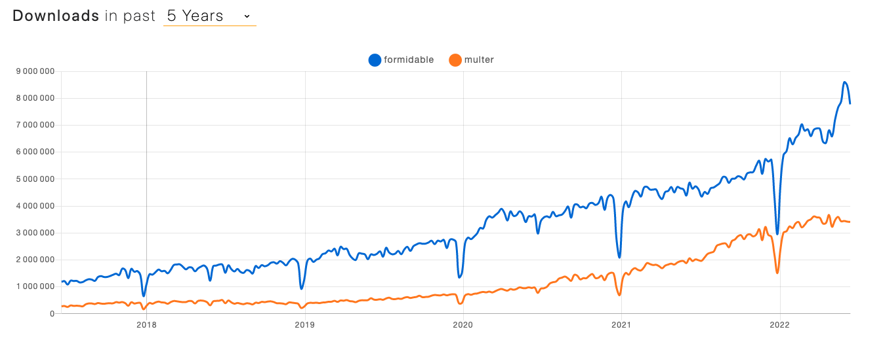
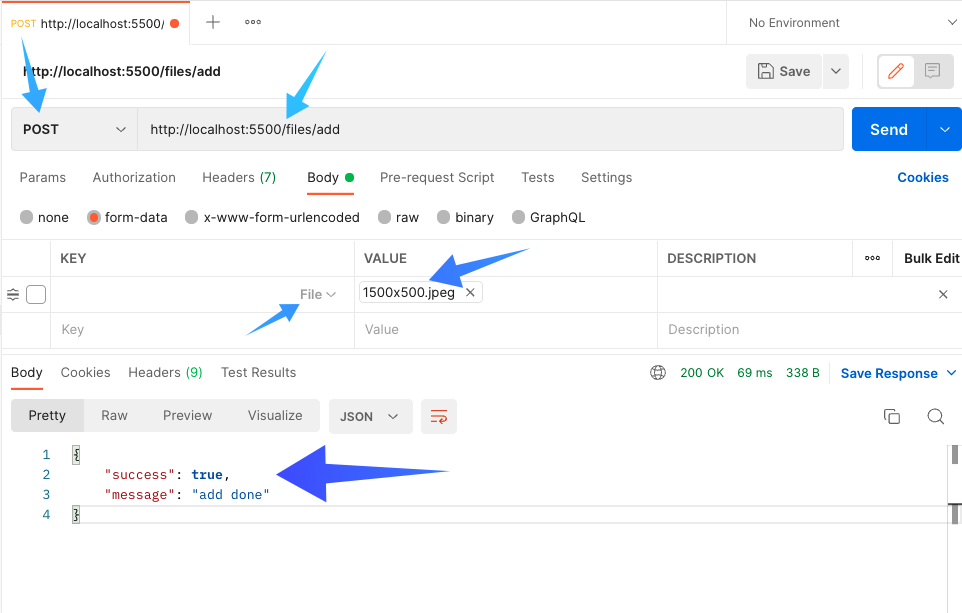

# Upload un fichier

Comment envoyer un fichier ?

Il existe plusieurs moyens de faire cela.

Nous avons plusieurs packages qui vous permettent de faire cela.

Les plus connus :
- [multer](https://www.npmjs.com/package/multer)
- [formidable](https://www.npmjs.com/package/formidable)


[Lien du trends](https://www.npmtrends.com/multer-vs-formidable)

Il y en a bien sûr, plein d'autres.

Mais nous allons nous concentrer sur [formidable](https://www.npmjs.com/package/formidable).

## Formidable

Il y a 3 branches, la branche du projet par défaut sera `crm`, ensuite la branche `backend` sera uniquement dédiée à la configuration de `express` & `formidable` et la branche `frontend` sera dédiée pour notre appel à l'api avec axios.

## ⚙️ Backend

```shell
npm install formidable
```

Nous allons créer un `middleware` pour la gestion de nos fichiers. Pourquoi faire un `middleware` ? 

Car nous allons juste utiliser `formidable` pour gérer les fichiers dans le reste des cas j'en ai pas besoin.

```js
// ./src/middleware/fileMiddleware.js
const fs = require("fs");
const UPLOADS = "./uploads";
const formidable = require("formidable");

const fileMiddleware = (req, res, next) => {
    // create folder if not exist
    if (!fs.existsSync(UPLOADS)) {
        // create folder
        fs.mkdirSync(UPLOADS);
    }
    // create form
    const form = new formidable.IncomingForm({
        uploadDir: UPLOADS,
        keepExtensions: true,
    });
    // parse form
    form.parse(req, (err, fields, files) => {
        // check error
        if (err) {
            // return error
            res.status(500).json({ validationErrors: [{ message: err.message }] });
        } else {
            // else add fields to req.body & files to req.files
            req.body = fields;
            req.files = files;
            next();
        }
    });
};

module.exports = fileMiddleware;
```

Une fois le `middleware` créé, nous allons l'ajouter à notre notre route.

```js
// .src/routes/index.js
const router = require("express").Router();
const fileMiddleware = require("../middleware/fileMiddleware");

router.post("/add", fileMiddleware, (req, res) => {
    res.status(200).json({ success: true, message: "add done" });
});

module.exports = router;
```

Nous allons tester si l'upload fonctionne avec `postman`.


⚠️ Pour le screenshot j'ai du décocher la ligne du milieu.
Mais pour le bien du test, il faut bien sûr l'activer.

Notre `Backend` à l'air de bien fonctionner.
